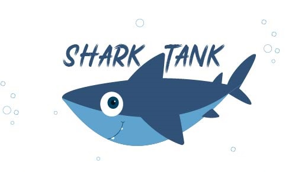
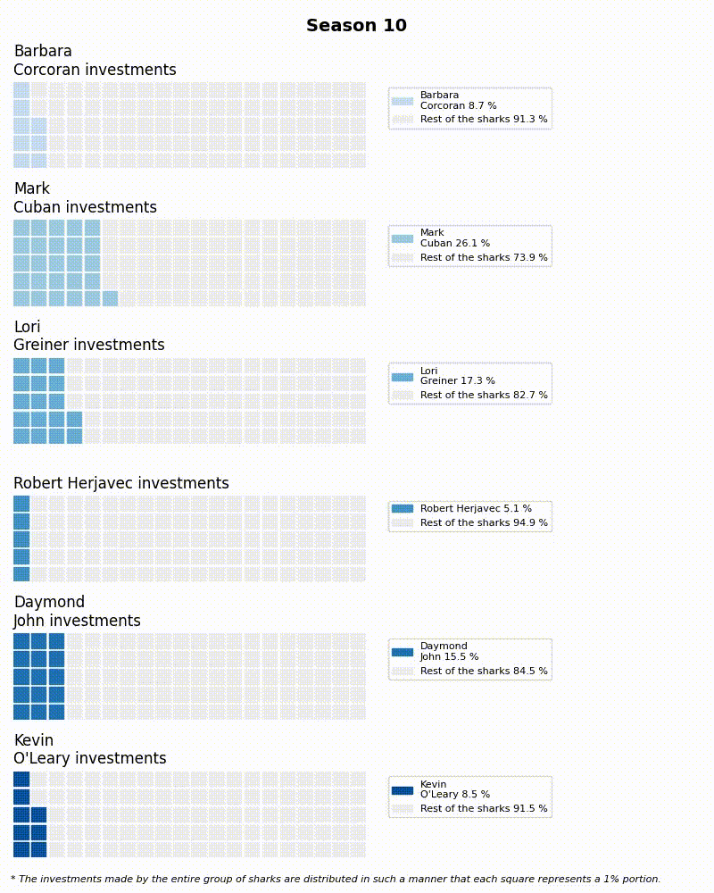

  

* [Introduction](#Introduction)
* [Number of Investments Made over the Seasons](#Number-of-Investments-Made-over-the-Seasons)
* [Investment Percentage: Sharks vs. Rest of the Panel in Each Season](#Investment-Percentage-Sharks-vs-Rest-of-the-Panel-in-Each-Season)
* [Number of Investments Made by Each Shark Divided by Gender during the 10 Seasons](#Number-of-Investments-Made-by-Each-Shark-Divided-by-Gender-during-the-10-Seasons)
* [Shark Preferences: Multi-Entrepreneur vs. Solo Entrepreneur Investments](#Shark-Preferences-Multi-Entrepreneur-vs-Solo-Entrepreneur-Investments)
* [Average Equity of Each Shark over Closing Deals, Divided by Gender](#Average-Equity-of-Each-Shark-over-Closing-Deals,-Divided-by-Gender)
* [Industries that Have Experienced Temperature Changes over 10 Seasons](#Industries-that-Have-Experienced-Temperature-Changes-over-10-Seasons)
* [Top episodes with the highest audience viewership – Using Web Scraping](#Top-episodes-with-the-highest-audience-viewership–Using-Web-Scraping)
* [Sharks' Preferred Industries for Investments](#sharks-preferred-industries-for-investments)

## Introduction 
Today, we will be working with a dataset obtained from the Kaggle website. The dataset we are focusing on pertains to the popular TV show called "Shark Tank." For those unfamiliar with the show, it features entrepreneurs who present their products or services to a panel of lenders known as "sharks" in exchange for financial investment. The entrepreneurs deliver presentations to the panel, seeking monetary backing in return for a percentage of their company.

This televised format, showcasing angel investment (where high net worth individuals invest their own money and time), provides valuable insights into discussions on equity, funding, valuation, and growth strategies.

The dataset we are working with contains information about the "Shark Tank" series aired on the ABC channel. It comprises 27 columns and 900 rows, forming a matrix of 900 * 27. Each row provides information about an aspiring entrepreneur venturing into the business world.

The column names include: 

## Number of Investments Made over the Seasons
Our initial objective is to analyse the dataset and gather information on the total number of investments made by the panel of sharks in each season. To accomplish this, we aim to present this data visually using an area chart.

Upon examining the data, we observe a significant surge in the number of investments over the years, particularly between the second and sixth seasons. During this period, there was a remarkable increase of almost  ~250%, with investments rising from 19 in the second season to 66 in the sixth season.

## Investment Percentage: Sharks vs. Rest of the Panel in Each Season
One intriguing aspect we want to delve into is the level of investment made by each shark or guest on the show. Essentially, we aim to determine how much personal capital each individual is willing to invest in new entrepreneurial ideas. To shed light on this question, we conducted an analysis for each season, spanning from the first to the tenth. The chart below allows us to examine the percentage of investments made by a specific shark or guest in each season individual

  

---

## Number of Investments Made by Each Shark Divided by Gender during the 10 Seasons
The chart below displays the number of deals made by each shark in the panel over the years during entrepreneur presentations. Specifically, we are interested in determining the number of closed deals made by each shark, categorized by gender (male and female). For instance, Kavin had the highest number of deals with 132, this number doesn’t excluding those made with multiple entrepreneurs. Out of these, 93 deals (70.4%) were with male entrepreneurs, while the remaining 39 (29.6%) were with female entrepreneurs.

---

## Shark Preferences: Multi-Entrepreneur vs. Solo Entrepreneur Investments
Our next objective is to determine the number of investments made by each shark with regards to entrepreneurs. Specifically, we want to understand the sharks' preferences when it comes to investing in solo entrepreneurs versus multiple entrepreneurs.
Interestingly, we observe that all sharks show a clear inclination towards investing in companies that have multiple partners rather than those led by a single individual. They tend to allocate a higher number of investments to companies with several stakeholders compared to those primarily led by a single person.

---

## Average Equity of Each Shark over Closing Deals, Divided by Gender
The next thing that we would like to dive into is to find out for each deal which has been closed by each shark, what was the amount of equity settled during the negotiation process between the entrepreneur VS the shark. Therefore, we decided to add another element to the equation - for each closed deal by each shark we will divide the deals by the gender of the entrepreneur. For example : Mark Cuban, during 10 seasons of the show that has been aired on TV, he made 68 investment deals with entrepreneurs over the show. As we can notice below, The average equity (%) for a male entrepreneur was 28.6%, while the average equity (%) for a female entrepreneur was 26.4%.

---

## Industries that Have Experienced Temperature Changes over 10 Seasons

Over the course of the first ten years, the show has been televised, numerous pitch presentations have taken place in front of the sharks panel. These pitches spanned various industries, ranging from “online services” to the "baby and Child care" sector. As a result, our upcoming research aims to uncover the industries that have experienced shifts in temperature over the ten-year period. By addressing this question, we can identify which industries have reached their peak or declined from their peak.

---
## Top episodes with the highest audience viewership – Using Web Scraping

We wanted to gather information about the top episodes from each season of Shark Tank, spanning from the first season to the tenth season, which have been broadcasted on TV. Since this data was not available in our dataset, we conducted a web search and found the relevant information on the Wikipedia page for Shark Tank.

To extract the necessary details, we scraped the data from the Wikipedia page, specifically focusing on the following fields:

Season number
Episode
Number of viewers (audience)
After retrieving this data, we proceeded to select the top 8 episodes for each season. We then visualized the results using a multi-bubble chart design created with Plotly.

## Sharks' Preferred Industries for Investments
As we are aware, in each episode of every season, the sharks make multiple investment decisions to become stakeholders in various projects or companies. These companies operate in diverse industries such as toys and games, electronics, specialty food, and more.

In our upcoming analysis, we aim to gain a deeper understanding of the specific industries in which the sharks have chosen to invest with entrepreneurs. Furthermore, we have included the monetary amounts that each shark has decided to invest in these industries. 

I would like to explore the investment patterns of each shark in different industries. By analyzing the data, I aim to determine which shark has a strong preference for investing in the technology sector, or who shows a particular interest in the food industry. Additionally, I want to identify any industries that the sharks tend to avoid investing in or where they show minimal interest. Moreover, I am curious to know which shark has made the highest number of investments in total. 
Hence, I have chosen to visualize these findings by creating a 3-D plot. The plot will incorporate three dimensions:
1.	The names of each shark will represent the first dimension.
2.	The names of the industries in which the sharks have made investments over the years will form the second dimension.
3.	The third dimension will represent the amount of investment made by each shark in a particular industry.

Based on the animated chart we created, it is evident that the "Food and Beverage" industry stands out as one of the most appealing sectors for investment, according to the sharks. Additionally, two other industries, namely "Health" and "Lifestyle," are also recognized by the sharks and hold considerable allure.

